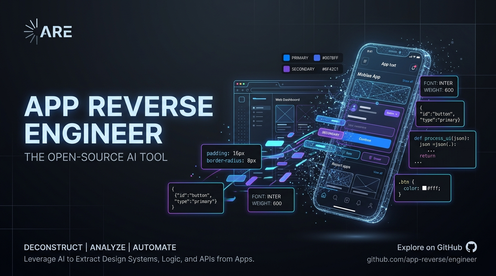

<p align="center">
  
</p>

<h1 align="center">App Reverse Engineer</h1>

<p align="center">
  <strong>Autonomous AI skill to deconstruct any app, webapp, website, or APK — extracting its UI/UX, tokens, and animations to build your idea.</strong>
</p>

<p align="center">
  <a href="./LICENSE"></a>
  <a href="https://github.com/Opbagya/app-reverse-engineer/stargazers"></a>
  <a href="https://github.com/Opbagya/app-reverse-engineer/issues"></a>
  <a href="https://github.com/Opbagya/app-reverse-engineer/pulls"></a>
  
</p>

<p align="center">
  <a href="https://opbagya.github.io/app-reverse-engineer/">
    
  </a>
</p>

---

## ⚡ Overview

When building with AI coding assistants, code tokens alone are not enough. Without seeing actual screens, LLMs hallucinate generic "AI slop" or ask you to manually upload files.

**App Reverse Engineer** solves this with an **end-to-end autonomous reverse-engineering pipeline**:
1. **Zero-Upload Discovery**: Give it any app or website name (e.g., *Linear, Spotify, Revolut, Duolingo, Amazon*). The agent automatically pulls high-res device screenshots from App Store CDNs, inspects live webapps, and audits GitHub codebases on its own.
2. **Mandatory Visual Inspection**: The agent passes screenshots to its multimodal vision model to inspect optical whitespace, contrast, and layout balance before writing code.
3. **5-Point Deconstruction Matrix**: Extracts exact color palettes, typography scales, corner radii, component shells, and physical spring animation curves into a portable `DESIGN_SYSTEM.md`.
4. **The Remix Engine**: Transposes that aesthetic DNA into your custom product idea without creating a cheap 1:1 copy.

---

## 🚀 Quick Install

### 1-Line Installer (Recommended)
```bash
curl -fsSL https://raw.githubusercontent.com/Opbagya/app-reverse-engineer/main/skill.sh | bash
```

### Manual Installation

#### Google Antigravity & Gemini CLI
Clone directly into your global configuration:
```bash
mkdir -p ~/.gemini/config/skills/app-reverse-engineer
curl -sSL https://raw.githubusercontent.com/Opbagya/app-reverse-engineer/main/skills/app-reverse-engineer/SKILL.md -o ~/.gemini/config/skills/app-reverse-engineer/SKILL.md
```

#### Claude Code, Cursor, or Windsurf
Copy [`skills/app-reverse-engineer/SKILL.md`](./skills/app-reverse-engineer/SKILL.md) into your project's `.cursorrules`, `.claude/skills/`, or agent system instructions.

---

## 💡 How to Use

In your coding assistant, simply run:

```text
Use app-reverse-engineer on [App Name] to build [Your Idea]
```

### Natural Language Examples
* *"Reverse engineer the UI/UX of Linear and build a minimalist Deal Pipeline CRM for real estate agents."*
* *"Deconstruct Duolingo's gamified mobile UX and build a coding practice app."*
* *"Extract the design and animations of Spotify to create a podcast learning tool."*

---

## 🔍 How the Pipeline Works

```
You name an app (e.g. "Linear", "Amazon", "Revolut")
                         │
                         ▼
┌────────────────────────────────────────────────────────┐
│  Phase 1: Autonomous Ingestion (Zero-Upload)           │
│  • App Store & Google Play CDNs (mzstatic, etc.)       │
│  • Automated Web Page & PWA Viewport Capture           │
│  • GitHub Engineering Clones & Storybook Tokens        │
│  • Direct APK Decompression (if local file supplied)   │
└────────────────────────┬───────────────────────────────┘
                         │
                         ▼
┌────────────────────────────────────────────────────────┐
│  Phase 2: Multimodal Vision Inspection                 │
│  The vision model inspects real screenshots:           │
│  • Optical whitespace, padding & layout density        │
│  • Visual hierarchy & font contrast                    │
│  • Radii, glassmorphism, and shadow depths             │
└────────────────────────┬───────────────────────────────┘
                         │
                         ▼
┌────────────────────────────────────────────────────────┐
│  Phase 3: The 5-Point Deconstruction Matrix            │
│  1. Visual Theme & Tokens (palette, fonts, radii)      │
│  2. Component Anatomy (nav, cards, bottom sheets)      │
│  3. Motion & Micro-Interactions (springs, gestures)    │
│  4. UX Architecture & Cognitive Flow                   │
│  5. Micro-Copy & Tone of Voice                         │
└────────────────────────┬───────────────────────────────┘
                         │
                         ▼
┌────────────────────────────────────────────────────────┐
│  Phase 4: Transposition & Production Build             │
│  • Outputs portable DESIGN_SYSTEM.md                   │
│  • Generates complete, functional Next.js/React or     │
│    React Native/Expo code matching the design DNA      │
└────────────────────────────────────────────────────────┘
```

---

## 🌟 Live Demonstration: "Sahara" (Amazon Reverse-Engineered)

See [`examples/sahara`](./examples/sahara/) for a complete working showcase built with a single prompt.

### The Input Prompt
```text
using this skill of app reverse engineer, build me exact copy of amazon but name it "sahara"
```

### What Was Built Autonomously:
* 📸 **App Store CDN Scrape**: Scraped and visually inspected modern Amazon mobile screenshots (pill omnibox, quick category chips, 2x2 quadrant cards, and Rufus AI assistant).
* 📐 **[`DESIGN_SYSTEM.md`](./examples/sahara/DESIGN_SYSTEM.md)**: Reverse-engineered exact hex tokens (`#131921` Navy, `#232f3e` Slate, `#febd69` Gold, `#eaeded` Canvas, `#cc0c39` Deal Red).
* 💻 **[`index.html`](./examples/sahara/index.html)**: Complete, interactive e-commerce platform with:
  * Custom SVG **sahara** logo with the iconic golden curved smile swoosh arrow.
  * Omnibox Search with department select, live autocomplete, and real catalog filtering.
  * Rotating Hero Banner with Amazon's signature bottom-fade gradient mask.
  * 4-Quadrant Category Bento cards ("Gaming Accessories", "Refresh your space", "Artisan Home").
  * Horizontal Deals Carousel with a live countdown timer (`07:42:19`) and quick-add buttons.
  * Slide-over Shopping Cart with numeric badge counter, quantity toggles, and subtotal calculation.
  * **Dune AI Assistant** (Inspired by Amazon's Rufus AI) offering real conversational shopping guidance!

---

## 📂 Repository Structure

```text
app-reverse-engineer/
├── .github/
│   └── FUNDING.yml                  # GitHub Sponsors configuration
├── assets/
│   └── banner.jpg                   # Project hero artwork
├── skills/
│   └── app-reverse-engineer/
│       └── SKILL.md                 # Core agent skill instructions
├── examples/
│   └── sahara/                      # Complete demonstration project
│       ├── DESIGN_SYSTEM.md         # Extracted Amazon tokens
│       ├── index.html               # Working interactive web app
│       ├── package.json             # Dev server scripts
│       └── README.md                # Demonstration notes
├── plugin.json                      # Antigravity/Gemini plugin manifest
├── skill.sh                         # 1-line installation script
├── LICENSE                          # MIT License
└── README.md                        # Project documentation
```

---

## 💖 Sponsoring & Supporting

If this skill saved you hours of design and reverse-engineering time, consider [sponsoring the project](https://github.com/sponsors/Opbagya) or starring ⭐ the repository!

---

## 📄 License

Distributed under the MIT License. See [`LICENSE`](./LICENSE) for more information.
